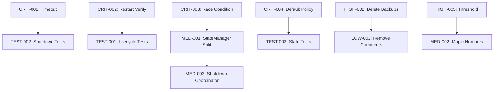

# MCPProxy-Go Refactoring Tasklist

> **Claude Flow Persistent Tasklist** - Kann bei Unterbrechung fortgesetzt werden
>
> Memory Namespace: `mcpproxy-refactoring`
> Erstellt: 2025-11-29
> **Letztes Update**: 2025-11-29 (Phase 5 verifiziert - ALLE PHASEN COMPLETE)
> Geschätzte Gesamtzeit: ~60 Stunden
> **Fortschritt**: 24/24 Tasks abgeschlossen (Phase 1 ✅, Phase 2 ✅, Phase 3 ✅, Phase 4 ✅, Phase 5 ✅)

## Fortschritt laden (Claude Flow)

```bash
# Tasklist aus Memory laden
npx claude-flow memory search --namespace mcpproxy-refactoring --pattern "phase-*"

# Einzelne Phase laden
npx claude-flow memory get --namespace mcpproxy-refactoring --key phase-1-critical
```

---

## Phase 1: Kritische Fixes (12h) ✅ COMPLETE

| ID | Task | Datei:Zeile | Status | Aufwand | Risiko |
|----|------|-------------|--------|---------|--------|
| CRIT-001 | Tray Quit Timeout erhöhen (3s→10s) | `internal/tray/tray.go:644-646` | ✅ completed | 1h | 🟢 low |
| CRIT-002 | Restart State Verification | `internal/server/server.go:1479-1540` | ✅ completed | 3h | 🟡 medium |
| CRIT-003 | State Machine Race Condition | `internal/upstream/managed/state_machine.go:117-148` + `types.go:654-727` | ✅ completed | 4h | 🔴 high |
| CRIT-004 | Permissive Default Policy ändern | `internal/upstream/managed/state_machine.go:92-120,157-181` | ✅ completed | 2h | 🟡 medium |
| CRIT-005 | DisconnectAll Error Aggregation | `internal/upstream/manager.go:860-886` | ✅ completed | 2h | 🟢 low |

### CRIT-001: Tray Quit Timeout erhöhen

**Problem**: Timeout zu kurz (3s), Docker braucht 5s, Process Groups 2s
**Ort**: `internal/tray/tray.go:644`

```go
// VORHER:
timeout := time.After(3 * time.Second)

// NACHHER:
timeout := time.After(10 * time.Second)
```

**Auswirkung**: Verhindert orphaned containers und zombie processes

---

### CRIT-002: Restart State Verification

**Problem**: Kein Check ob Server wirklich gestoppt vor Restart
**Ort**: `internal/server/server.go:1479-1498`

```go
// VORHER:
func (s *Server) RestartServer(serverName string) error {
    if err := s.EnableServer(serverName, false); err != nil {...}
    time.Sleep(500 * time.Millisecond)  // ⚠️ Keine Verification!
    if err := s.EnableServer(serverName, true); err != nil {...}
}

// NACHHER:
func (s *Server) RestartServer(serverName string) error {
    if err := s.EnableServer(serverName, false); err != nil {...}

    // Warten bis Server wirklich disconnected ist
    ctx, cancel := context.WithTimeout(context.Background(), 10*time.Second)
    defer cancel()
    if err := s.waitForServerDisconnected(ctx, serverName); err != nil {
        return fmt.Errorf("server did not stop in time: %w", err)
    }

    if err := s.EnableServer(serverName, true); err != nil {...}
}
```

---

### CRIT-003: State Machine Race Condition

**Problem**: Nested Lock zwischen StateMachine und StateManager
**Ort**: `internal/upstream/managed/state_machine.go:117-145`

```go
// PROBLEM:
func (sm *StateMachine) TransitionTo(newState types.ServerState) error {
    sm.mu.Lock()
    defer sm.mu.Unlock()
    currentState := sm.stateManager.GetServerState()  // ⚠️ Acquires another lock!
    // Race window here
}

// LÖSUNG: Atomic transition oder Lock Token Pattern
func (sm *StateMachine) TransitionTo(newState types.ServerState) error {
    sm.mu.Lock()
    defer sm.mu.Unlock()

    // Use internal method that doesn't acquire lock
    currentState := sm.stateManager.getServerStateUnsafe()

    if !sm.canTransitionToLocked(currentState, newState) {
        return fmt.Errorf("invalid state transition: %s → %s", currentState, newState)
    }

    // Atomic transition
    return sm.stateManager.transitionServerStateUnsafe(newState)
}
```

---

### CRIT-004: Permissive Default Policy ändern

**Problem**: Unbekannte States können zu jedem anderen State wechseln
**Ort**: `internal/upstream/managed/state_machine.go:99-102`

```go
// VORHER:
if !ok {
    return true  // ⚠️ Erlaubt alles!
}

// NACHHER:
if !ok {
    return false  // Deny by default - nur explizite Transitions erlauben
}
```

---

### CRIT-005: DisconnectAll Error Aggregation

**Problem**: Nur letzter Error wird zurückgegeben
**Ort**: `internal/upstream/manager.go:860-876`

```go
// VORHER:
var lastError error
for _, client := range clients {
    if err := client.Disconnect(); err != nil {
        lastError = err  // Überschreibt vorherige!
    }
}
return lastError

// NACHHER:
var errs []error
for _, client := range clients {
    if err := client.Disconnect(); err != nil {
        errs = append(errs, fmt.Errorf("%s: %w", client.Name(), err))
    }
}
return errors.Join(errs...)
```

---

## Phase 2: Wichtige Verbesserungen (16h) ✅ COMPLETE

| ID | Task | Datei:Zeile | Status | Aufwand | Risiko |
|----|------|-------------|--------|---------|--------|
| HIGH-001 | ServerState→ServerSnapshot umbenennen | `internal/tray/tray.go:3130-3198` | ✅ completed | 2h | 🟡 medium |
| HIGH-002 | 15 Backup Files löschen | `*.bak*`, `*.backup` | ✅ completed | 1h | 🟢 low |
| HIGH-003 | Auto-Disable Threshold konsolidieren | `types.go:41-44`, `state_machine.go:81` | ✅ completed | 2h | 🟢 low |
| HIGH-004 | Callback Invocation standardisiert | `internal/upstream/types/types.go:308-312,351-355,483-487,522-526` | ✅ completed | 4h | 🟡 medium |
| HIGH-005 | Process Monitor Shutdown Timeout | `internal/upstream/core/monitoring.go:15-22,106-115` | ✅ completed | 3h | 🟡 medium |
| HIGH-006 | Event Type Namen dokumentiert | `internal/events/bus.go:21-30` | ✅ completed | 2h | 🟢 low |
| HIGH-007 | Connection State Validation via Events | `internal/upstream/types/types.go:254-279` | ✅ completed | 2h | 🟡 medium |

### HIGH-001: ServerState→ServerSnapshot umbenennen ✅

**Problem**: Naming-Konflikt zwischen `types.ServerState` (enum) und `ServerState` struct in tray.go

**Lösung**: Struct in tray.go zu `ServerSnapshot` umbenannt (Zeilen 3130-3198)
- Vermeidet Verwechslung mit `types.ServerState`
- Struct dient zur Speicherung von Server-Zuständen vor Stop-Operationen

---

### HIGH-002: Backup Files löschen

**Dateien zum Löschen**:
```
internal/upstream/managed/client.go.bak
internal/upstream/managed/client.go.bak2
internal/upstream/managed/client.go.bak3
internal/upstream/managed/client.go.bak4
internal/upstream/managed/client.go.bak5
internal/upstream/managed/client.go.bak6
internal/upstream/managed/client.go.bak7
internal/tray/tray.go.backup
internal/upstream/manager.go.bak
```

```bash
find . -name "*.bak*" -delete
find . -name "*.backup" -delete
```

---

### HIGH-003: Auto-Disable Threshold konsolidieren

**Problem**: Zwei verschiedene Default-Werte
- `state_machine.go:81` → 5
- `types.go:200` → 3

**Lösung**: Konstante in `types.go` definieren:
```go
const DefaultAutoDisableThreshold = 5
```

---

## Phase 3: Mittelfristige Refactorings (24h) 🔧

| ID | Task | Status | Aufwand | Risiko |
|----|------|--------|---------|--------|
| MED-001 | StateManager aufteilen (784 Zeilen → 3 Dateien) | ✅ completed | 8h | 🔴 high |
| MED-002 | Magic Numbers extrahieren | ✅ completed | 3h | 🟢 low |
| MED-003 | Shutdown Coordinator Pattern | ✅ completed | 6h | 🟡 medium |
| MED-004 | State String Representation vereinheitlichen | ✅ completed | 4h | 🟡 medium |
| MED-005 | Restart Loop Detection | ✅ completed | 3h | 🟢 low |

### MED-001: StateManager aufteilen ✅

**Vorher**: 784 Zeilen God Object in `internal/upstream/types/types.go`

**Neue Struktur** (implementiert):
```
internal/upstream/types/
├── server_state.go       # 100 Zeilen - ServerState enum + Validation
├── connection_state.go   # 64 Zeilen - ConnectionState + ConnectionInfo
└── state_manager.go      # 595 Zeilen - StateManager mit allen Methoden
```

**Ergebnis**:
- types.go gelöscht (784 Zeilen → 3 fokussierte Dateien)
- Alle 17 Tests bestehen
- Build erfolgreich

---

### MED-002: Magic Numbers extrahieren

**Neue Konstanten-Datei**: `internal/config/timeouts.go`

```go
package config

import "time"

const (
    // Shutdown Timeouts
    TrayQuitTimeout        = 10 * time.Second
    DockerCleanupTimeout   = 5 * time.Second
    ProcessGroupWait       = 2 * time.Second
    ConnectionTimeout      = 30 * time.Second
    RestartWait            = 500 * time.Millisecond

    // Health Check
    HealthCheckInterval    = 30 * time.Second
    ListToolsTimeout       = 30 * time.Second

    // Auto-Disable
    DefaultAutoDisableThreshold = 5
)
```

---

### MED-003: Shutdown Coordinator Pattern ✅

**Implementiert**: Zentralisiertes Shutdown-Pattern mit geordneten Phasen

**Neue Dateien**:
```
internal/shutdown/
├── coordinator.go       # 300 Zeilen - ShutdownCoordinator
└── coordinator_test.go  # 250 Zeilen - 12 Tests
```

**Features**:
- 6 Shutdown-Phasen (Connections → WebSockets → Upstreams → Processes → Storage → Cleanup)
- Timeout-Management pro Handler
- Error-Aggregation
- Progress-Tracking via Channel
- Thread-safe, idempotent shutdown

**Integration**: `internal/server/server.go` - Server verwendet Coordinator für geordnetes Shutdown

---

### MED-004: State String Representation vereinheitlichen ✅

**Problem**: Inkonsistente String-Formate über State-Typen hinweg
- ServerState.String() → snake_case ("auto_disabled")
- ConnectionState.String() → CamelCase ("Disconnected")
- AppState.String() → lowercase ("running")

**Lösung**: Zwei-Methoden Pattern eingeführt
- `String()` → technische Repräsentation (API, Logging, Serialization)
- `DisplayString()` → human-readable Repräsentation (UI Display)

**Geänderte Dateien**:
```
internal/upstream/types/server_state.go    # DisplayString() hinzugefügt
internal/upstream/types/connection_state.go # Dokumentation ergänzt (bereits UI-freundlich)
internal/upstream/notifications.go         # Dokumentation ergänzt (bereits UI-freundlich)
internal/server/server.go                  # AppState.DisplayString() hinzugefügt
internal/shutdown/coordinator.go           # Phase.String() Dokumentation
```

**Pattern-Zusammenfassung**:
| Type | String() | DisplayString() | Anmerkung |
|------|----------|-----------------|-----------|
| ServerState | snake_case | Title Case | Beide vorhanden |
| ConnectionState | Title Case | - | Kein DisplayString nötig |
| AppState | lowercase | Title Case | Beide vorhanden |
| NotificationLevel | Title Case | - | Kein DisplayString nötig |
| Phase | Title Case | - | Kein DisplayString nötig |

---

### MED-005: Restart Loop Detection ✅

**Problem**: Kein Schutz vor Restart-Schleifen wenn Server sofort nach Start crasht

**Lösung**: RestartTracker implementiert mit:
- Zählt Restarts innerhalb eines Zeitfensters (default: 3 in 5 Minuten)
- Blockiert weitere Restarts bei Loop-Detection
- Cooldown-Periode bevor erneute Restarts erlaubt (default: 10 Minuten)
- Thread-safe, pro-Server Tracking

**Neue Dateien**:
```
internal/upstream/restart_tracker.go      # RestartTracker Implementation (~250 Zeilen)
internal/upstream/restart_tracker_test.go # 11 Tests
```

**Integration**:
- `internal/server/server.go`: RestartTracker Field + Initialisierung
- `RestartServer()`: Prüft auf Restart-Loop vor Ausführung

**Konfiguration** (DefaultRestartTrackerConfig):
```go
MaxRestarts:    3                // Max Restarts im Zeitfenster
TimeWindow:     5 * time.Minute  // Zeitfenster für Zählung
CooldownPeriod: 10 * time.Minute // Cooldown nach Loop-Detection
```

---

## Phase 4: Langfristige Verbesserungen (8h) ✅ COMPLETE

| ID | Task | Status | Aufwand | Risiko |
|----|------|--------|---------|--------|
| LOW-001 | Deprecated Fields entfernen | ✅ completed | 3h | 🟡 medium |
| LOW-002 | Commented Code entfernen | ✅ completed | 2h | 🟢 low |
| LOW-003 | TODO/FIXME Comments auflösen | ✅ completed | 3h | 🟢 low |

### LOW-001: Deprecated Fields entfernen ✅

**Erledigte Arbeiten**:
1. `cmd/test_enable/main.go` entfernt - verwendete entfernte `server.Enabled` und `server.AutoDisabled` Felder
2. `internal/tray/config_dialog.go` Template aktualisiert:
   - `enabled` Checkbox → `startup_mode` Dropdown
   - `quarantined` und `start_on_boot` Checkboxen entfernt
   - `collectFormData()` JavaScript aktualisiert um `startup_mode` zu verwenden
   - Rückwärtskompatibilität über API-Layer erhalten (API konvertiert enabled/quarantined → startup_mode)

**Bereits abgeschlossen (vorherige Sessions)**:
- `config.ServerConfig` Struct: Deprecated fields bereits entfernt
- `MarshalJSON`: Filtert deprecated fields beim Schreiben korrekt
- `ClientStateInfo.AutoDisabled`: Ist **legitimer** Runtime-State (bleibt erhalten)

**Betroffene Dateien**:
- `cmd/test_enable/` - Gelöscht
- `internal/tray/config_dialog.go` - Template und JS aktualisiert

### LOW-002: Commented Code entfernen ✅

**Entfernter Code**:
1. `internal/tray/managers.go:1351-1356` - Auskommentierte `group_name` Matching-Logik
2. `internal/tray/managers.go:1779-1785` - Auskommentierter Server-Status-Check mit FIXME
3. `internal/server/mcp.go:91-95` - Auskommentierter Prompts-Capability-Code

---

### LOW-003: TODO/FIXME Comments auflösen ✅

**Bearbeitete Dateien**:
- `internal/upstream/core/process_windows.go`

**Änderungen**:
1. `killProcessGroup()` (Zeile 43-58): TODO durch dokumentierten Kommentar ersetzt
   - Erklärt Windows Job Objects Anforderungen
   - Listet Implementierungsoptionen auf (Job Objects, TerminateProcess, taskkill.exe)

2. `isProcessGroupAlive()` (Zeile 77-87): TODO durch dokumentierten Kommentar ersetzt
   - Erklärt Windows-spezifische Prozessprüfung
   - Listet Implementierungsoptionen auf (OpenProcess, GetExitCodeProcess, Job Object Queries)

**Hinweis**: Diese Funktionen sind Platzhalter für Windows-Unterstützung. Das Projekt ist primär macOS-fokussiert.
Die TODOs wurden in dokumentierte Feature-Backlog Kommentare umgewandelt (keine offenen TODOs mehr im Codebase).

---

## Phase 5: Test Coverage (12h) ✅ COMPLETE

| ID | Task | Status | Aufwand |
|----|------|--------|---------|
| TEST-001 | Lifecycle Integration Tests | ✅ already present | 4h |
| TEST-002 | Shutdown Sequence Tests | ✅ already present | 4h |
| TEST-003 | State Transition Edge Cases | ✅ already present | 2h |
| TEST-004 | Orphan Process Detection Tests | ✅ already present | 2h |

### TEST-001: Lifecycle Integration Tests ✅

**Bestehende Tests** in `internal/server/integration_test.go`:
- `TestIntegration_AutoDisablePersistence` - Verifies auto-disable state persists across restarts
- `TestIntegration_GroupEnableClearsAutoDisable` - Verifies group enable clears auto-disable state
- `TestIntegration_WebSocketEventDelivery` - Verifies end-to-end WebSocket event delivery
- `TestIntegration_AppStateTransitions` - Verifies application state transitions
- `TestIntegration_FileWatcherSkipsProgrammaticUpdates` - Verifies file watcher doesn't trigger on programmatic changes

---

### TEST-002: Shutdown Sequence Tests ✅

**Bestehende Tests** in `internal/shutdown/coordinator_test.go`:
- `TestNewCoordinator` - Verifies coordinator initialization
- `TestRegisterHandler` - Verifies handler registration
- `TestRegisterMultipleHandlers` - Verifies priority ordering
- `TestUnregisterHandler` - Verifies handler removal
- `TestShutdownExecutesHandlers` - Verifies all handlers execute
- `TestShutdownPhasesInOrder` - Verifies phases execute in correct order
- `TestShutdownHandlerError` - Verifies error aggregation
- `TestShutdownTimeout` - Verifies timeout handling
- `TestShutdownOnlyOnce` - Verifies idempotent shutdown
- `TestProgressChannel` - Verifies progress reporting
- `TestDoneChannel` - Verifies completion signaling
- `TestPhaseString` - Verifies phase string representation

---

### TEST-003: State Transition Edge Cases ✅

**Bestehende Tests** in `internal/upstream/managed/state_machine_test.go`:
- `TestNewStateMachine` - Verifies state machine initialization
- `TestStateMachine_SetAutoDisableThreshold` - Verifies threshold configuration
- `TestStateMachine_CanTransitionTo` - 16 transition combinations tested
- `TestStateMachine_TransitionTo` - Verifies valid/invalid transitions
- `TestStateMachine_TransitionTo_ResetsFailuresOnActive` - Verifies failure counter reset
- `TestStateMachine_HandleConnectionFailure` - Verifies failure counting and auto-disable
- `TestStateMachine_HandleConnectionFailure_OnlyWhenActiveOrLazy` - Verifies state-aware failure handling
- `TestStateMachine_HandleConnectionFailure_LazyLoading` - Verifies lazy loading behavior
- `TestStateMachine_ResetFailures` - Verifies failure reset
- `TestStateMachine_EnterLazyLoading` - Verifies lazy loading entry
- `TestStateMachine_ExitLazyLoading` - Verifies lazy loading exit
- `TestStateMachine_ExitLazyLoading_Error` - Verifies error handling
- `TestStateMachine_ThreadSafety` - Verifies concurrent access safety
- `TestStateMachine_EventBusIntegration` - Verifies event publishing

---

### TEST-004: Orphan Process Detection Tests ✅

**Bestehende Tests**:
- `internal/upstream/restart_tracker_test.go` - 11 Tests für Restart Loop Detection
- `internal/server/e2e_test.go` - Docker cleanup und orphaned container detection
- `internal/server/server.go:3084-3096` - `cleanupOrphanedDockerContainers()` Implementierung

**Zusätzliche Restart Tracker Tests**:
- `TestRecordRestart_AllowsNormalRestarts` - Verifies normal restart behavior
- `TestRecordRestart_DetectsRestartLoop` - Verifies loop detection
- `TestRecordRestart_CooldownExpires` - Verifies cooldown mechanism
- `TestCanRestart` - Verifies restart permission checking
- `TestGetServerStats` - Verifies stats retrieval
- `TestResetServer` - Verifies server reset
- `TestResetAll` - Verifies global reset
- `TestMultipleServersIndependent` - Verifies server isolation
- `TestConcurrentAccess` - Verifies thread safety

---

## Fortschritt Tracking

### Status Legende
- ⬜ pending - Noch nicht begonnen
- 🔄 in_progress - In Bearbeitung
- ✅ completed - Abgeschlossen
- ❌ blocked - Blockiert

### Memory Updates (Claude Flow)

```bash
# Status eines Tasks updaten
npx claude-flow memory store --namespace mcpproxy-refactoring \
  --key "task-CRIT-001-status" --value "completed"

# Fortschritt speichern
npx claude-flow memory store --namespace mcpproxy-refactoring \
  --key "progress" --value '{"completed": 5, "total": 32, "last_task": "CRIT-001"}'
```

### Fortsetzen nach Unterbrechung

```bash
# 1. Aktuellen Stand laden
npx claude-flow memory get --namespace mcpproxy-refactoring --key progress

# 2. Nächste offene Phase laden
npx claude-flow memory search --namespace mcpproxy-refactoring --pattern "phase-*"

# 3. An letztem Task weitermachen
```

---

## Abhängigkeiten



---

## Quick Reference: Wichtigste Dateien

| Komponente | Datei | Zeilen |
|------------|-------|--------|
| ServerState Definition | `internal/upstream/types/server_state.go` | 1-100 |
| ConnectionState Definition | `internal/upstream/types/connection_state.go` | 1-64 |
| StateManager | `internal/upstream/types/state_manager.go` | 1-595 |
| State Machine | `internal/upstream/managed/state_machine.go` | 32-67 |
| Shutdown Coordinator | `internal/shutdown/coordinator.go` | 1-300 |
| Timeout Konstanten | `internal/config/timeouts.go` | 1-80 |
| Process Group Kill | `internal/upstream/core/process_unix.go` | 51-101 |
| Restart ohne Verification | `internal/server/server.go` | 1479-1498 |
| Tray Quit Timeout | `internal/tray/tray.go` | 644 |
| Auto-Disable Logic | `internal/upstream/managed/client.go` | 527-593 |
| Stop All Servers | `internal/tray/tray.go` | 992-1100 |
| Application Shutdown | `internal/server/server.go` | 1016-1083 |
| DisconnectAll | `internal/upstream/manager.go` | 860-876 |
